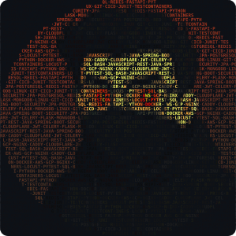

## Hi, I'm Aayansh Yadav!

I build concurrent systems that stay correct under load. BS Data Science, IIT Madras '27.

**The Stack**
Java | Spring Boot | Python | FastAPI | PostgreSQL | Redis | Docker | AWS

**The Proof**
* **Concurrency:** 1,000 concurrent withdrawals on one account settled exactly 10, zero overselling. 710 TPS under single-row contention. Deadlock-safe, double-entry, exactly-once.
* **Architecture:** Schema-isolated multi-tenant HR platform. 50+ APIs, per-tenant Postgres, automated SSL and subdomain routing on GCP.
* **Performance:** 350ms → 70ms on geospatial search (H3 indexing). 240ms → 45ms on threat evaluation (Redis + Docker on EC2).
* **ML:** Ranked 1 of 1,700+ in the IIT Madras ML competition.
* **DSA:** LeetCode Knight, 1872 rating, peak top 1.2%, 700+ solved.

Prev: SWE Intern @ Straive | SDE Intern @ Annam.AI

 
